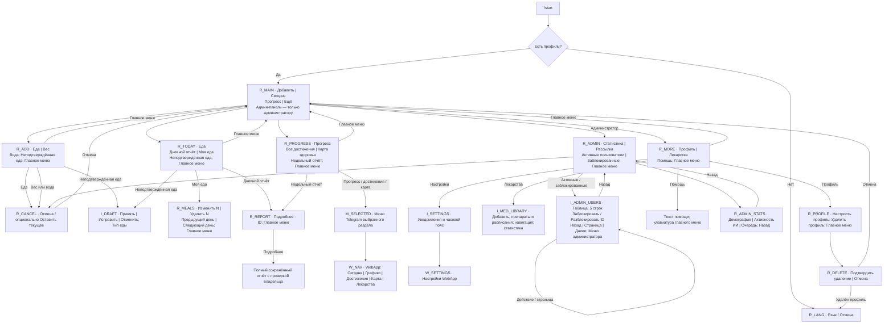
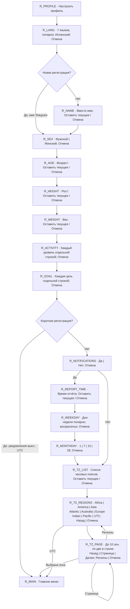
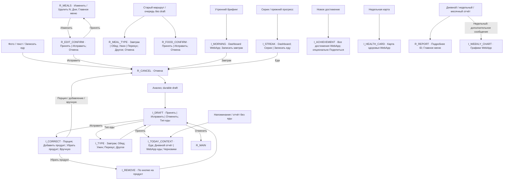
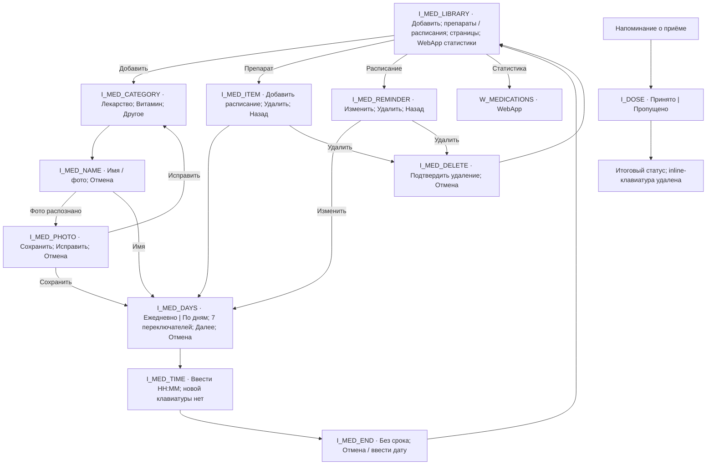
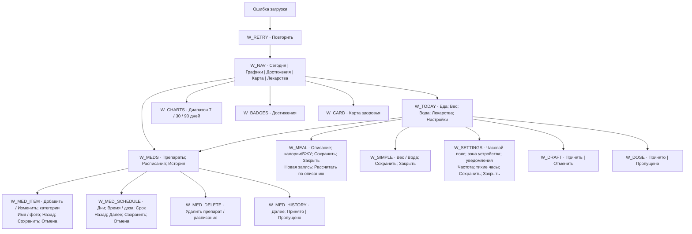
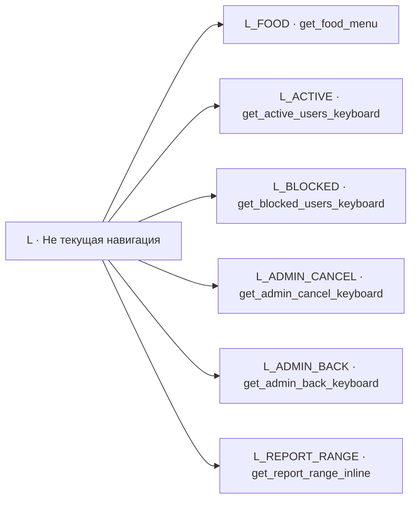

# Архитектура клавиатур Healthy Bot

Состояние кода: 2026-10-01. Это карта реализованных переходов для обсуждения и последующей имплементации. Изменения дизайна сначала отмечаем здесь; после реализации синхронизируем код, реестр строк ниже и `.agents/skills/keyboard-configuration/references/current-keyboard-variants.md`.

Обозначения: **R** — reply-клавиатура; **I** — inline-клавиатура; **M** — кнопка меню Telegram; **W** — кнопки WebApp; **L** — сохранённый legacy-builder без текущего вызова. ID узлов стабильны: например, `R_PROGRESS`, `I_ADMIN_USERS`, `R_TZ_REGIONS`. Текст в узлах — русские смысловые названия; точный порядок строк, ключи переводов и callbacks приведены в реестре ниже.

## Основные меню и администрирование

Меню Progress не открывает WebApp напрямую из reply-кнопки: выбор устанавливает персональную кнопку меню Telegram, затем пользователь нажимает её. Такой запуск передаёт signed initData; обычный reply WebApp-запуск — нет. Следующее взаимодействие с ботом восстанавливает меню «Сегодня». В «Ещё» кнопка настроек пока остаётся inline — это существующее поведение.

## Настройка профиля и динамические варианты

При редактировании имеющегося профиля первая строка соответствующих клавиатур — «Оставить: текущее значение». Возраст, рост, вес, имя и время используют общий `get_cancel_keyboard`; это отдельные состояния, а не отдельные builders. Отмена на любом шаге возвращает зарегистрированного пользователя в главное меню; незарегистрированный остаётся в регистрации.

## Еда, отчёты и автоматические сообщения

## Лекарства: inline-клавиатуры бота

Отмена/Назад в мастерах ведёт в библиотеку. Данные callback привязаны к владельцу препарата/расписания/приёма. Библиотека показывает до 15 записей на страницу.

## Кнопки и формы WebApp

## Сохранённые builders без текущего вызова

Старые callbacks `report_range:*`, `ux:report:*` и сообщения лекарств со скрытым `med:*` ещё обрабатываются для ранее отправленных сообщений. Это совместимость, а не новые клавиатуры.

## Контракт таблицы пользователей

- Входы: существующие «Активные пользователи» (все незаблокированные, не только недавно активные) и «Заблокированные» в админ-меню.
- Таблица в сообщении: имя / @username, Telegram ID, регистрация, последняя записанная активность. Формат HTML `<pre>`, даты UTC с точностью до минуты; отсутствие даты — `—`. Полные ID не сокращаются. Длинные имена/ники ограничиваются по длине, HTML и управляющие символы обезвреживаются.
- Последняя активность — максимум `MessageStat.sent_at` и `ProductEvent.occurred_at` для `active`; это сообщения/кнопки и WebApp. Телеметрия ProductEvent хранится 90 дней, поэтому более старые WebApp-события могут отсутствовать. Дата регистрации — завершение создания профиля.
- 5 строк на страницу; сортировка: регистрация по убыванию, затем ID. После блокировки/разблокировки список перечитывается, устаревший номер страницы ограничивается последней существующей.
- Inline: блокировка/разблокировка конкретного ID, навигация и возврат в админ-меню. Только текущий администратор в собственном приватном чате. Собственная учётная запись и администраторы защищены от блокировки.
- Callback задаёт конечное состояние: повторное нажатие Block оставляет пользователя заблокированным. Состояние FSM для списка не требуется; после перезапуска старые inline-сообщения продолжают работать.

## Как согласовывать дальнейшие изменения

Указываем ID экрана, тип клавиатуры, строки и действие каждой кнопки. Например: `R_PROGRESS: перенести Недельный отчёт в первую строку`. На этапе реализации обновляем граф и реестр, изменяем shared builders/handlers, проверяем переходы и права доступа. Вопросы внешнего дизайна обсуждаем отдельно от уже реализованного состояния. Архитектура не предполагает удаление legacy-кода без отдельного решения.

## Полный реестр строк и callback-контрактов

# Реестр клавиатур

This is the complete current keyboard inventory. A pipe (`|`) separates buttons in the same row; a semicolon (`;`) separates rows. `{...}` indicates runtime data. Labels written as `key` are resolved with `get_text(key, lang)` for all seven locales (`en`, `ru`, `uk`, `pl`, `de`, `tr`, `es`). Preserve the label key, callback shape, and row placement unless the requested change says otherwise.

### Shared reply keyboards

| Builder and variant | Current rows, in order |
| --- | --- |
| `get_main_menu(lang, is_admin=False)` | `ux_add` \| `ux_today`; `ux_progress` \| `ux_more`. |
| `get_food_menu(lang, has_pending_meals)` | Legacy builder only: `btn_new_food`; optional `btn_pending_meals`; `ux_back`. The current `btn_log_food`/`btn_new_food` routes prompt directly for a photo or description with Cancel. |
| `get_main_menu(..., is_admin=True)` | Standard main menu, then `👑 Admin Panel` for English or `👑 Админ-панель` for every other language |
| `get_admin_menu(lang)` | English/Russian legacy labels: `📊 Stats` \| `📢 Broadcast`; `👥 Active Users` \| `🚫 Blocked Users`; localized `ux_back` |
| `get_cancel_keyboard(lang, current_val=None)` | `btn_cancel` (all seven languages) |
| `get_cancel_keyboard(..., current_val={value})` | `btn_keep_current(value={value})`; then Cancel |
| `get_setup_profile_keyboard(lang)` | `btn_setup_profile`; `btn_delete_profile`; `ux_back` |
| `get_delete_confirm_keyboard(lang)` | `btn_confirm_delete`; `btn_cancel` |
| `get_lang_keyboard(lang, current_val=None)` | Optional `btn_keep_current(value={value})`; `English 🇺🇸` \| `Русский 🇷🇺`; `Українська 🇺🇦` \| `Polski 🇵🇱`; `Deutsch 🇩🇪` \| `Türkçe 🇹🇷`; `Español 🇪🇸`; Cancel |
| `get_sex_keyboard(lang, current_val=None)` | Optional Keep-current; `sex_male` \| `sex_female`; Cancel |
| `get_activity_keyboard(lang, current_val=None)` | Optional Keep-current; `act_sedentary`; `act_light`; `act_moderate`; `act_active`; Cancel |
| `get_goal_keyboard(lang, current_val=None)` | Optional Keep-current; `goal_lose`; `goal_maintain`; `goal_gain_w`; `goal_gain_m`; Cancel |
| `get_notifications_keyboard(lang, current_val=None)` | Optional Keep-current; `yes` \| `no`; Cancel |
| `get_timezone_list_button_keyboard(lang, current_val=None)` | Optional Keep-current; `btn_timezone_list`; Cancel |
| `get_timezone_regions_keyboard(lang)` | `Africa` \| `America` \| `Asia`; `Atlantic` \| `Australia` \| `Europe`; `Indian` \| `Pacific` \| `UTC`; `ux_previous` \| `btn_cancel`. UTC is selected directly. |
| `get_regional_timezone_keyboard(region, page, lang)` | 1–10 sorted `region/timezone` values, two per row; optional `⬅️` \| `{page}/{total_pages}` \| optional `➡️`; `ux_regions` \| `btn_cancel` |
| `get_weekly_report_day_keyboard(lang, current_val=None)` | Optional Keep-current using the localized current weekday; `weekday_0` \| `weekday_1`; `weekday_2` \| `weekday_3`; `weekday_4` \| `weekday_5`; `weekday_6`; Cancel |
| `get_monthly_report_day_keyboard(lang, current_val=None)` | Optional Keep-current; `1` \| `7` \| `15` \| `28`; Cancel |
| `get_meal_type_keyboard(lang)` | `meal_type_breakfast` \| `meal_type_lunch`; `meal_type_dinner` \| `meal_type_snack`; `meal_type_food`; Cancel |
| `get_food_confirm_keyboard(lang)` / `get_meal_edit_confirm_keyboard(lang)` | `btn_accept` \| `btn_correct`; `btn_cancel` |
| `get_meals_keyboard(meals, show_next, lang)` | For each meal: `btn_edit_meal(num={n})` \| `btn_delete_meal(num={n})`; `btn_prev_day` \| optional `btn_next_day`; `ux_back` |
| `get_active_users_keyboard(users, lang)` | Unused legacy builder: reply Block buttons containing user ID; replaced by `get_admin_users_inline`. |
| `get_blocked_users_keyboard(users, lang)` | Unused legacy builder: reply Unblock buttons containing user ID; replaced by `get_admin_users_inline`. |
| `get_admin_cancel_keyboard(lang)` | `btn_cancel` (all seven languages) |
| `get_admin_back_keyboard(lang)` | English `⬅️ Back to Menu`, otherwise Russian `⬅️ Назад в меню` |
| `get_admin_stats_keyboard(lang)` | `btn_stats_demographics` \| `btn_stats_engagement`; `btn_stats_ai` \| `btn_stats_queue`; `btn_stats_back_admin` |
| `get_section_menu('add', lang)` | `btn_log_food` \| `btn_log_weight`; `ux_water`; `btn_pending_meals`; `ux_back` |
| `get_section_menu('more', lang)` | `btn_my_profile` \| `btn_medications`; `btn_help`; `ux_back` |
| `get_today_keyboard(lang)` | `btn_log_food`; `btn_daily_report` \| `btn_my_meals` (chat history); `btn_pending_meals`; `ux_back`. Plain reply buttons use existing localized message handlers. |
| `get_progress_keyboard(lang)` | `ux_progress`; `btn_all_achievements` \| `btn_view_card`; `btn_weekly_report`; `ux_back`. First three plain reply buttons set the chat menu button to `?tab=charts`, `?tab=achievements`, or `?tab=health-card` respectively. The user then taps that menu button to launch with signed initData. |
| `get_report_keyboard(lang, {report_id})` | `ux_details · {report_id}`; `ux_back`. The reply handler obtains the ID from the label and sends only an owned `report_snapshot`. |

### Inline keyboards

| Builder and variant | Current buttons and action |
| --- | --- |
| `get_morning_actions_inline(lang)` | `btn_view_dashboard` → WebApp `WEBAPP_URL`; `btn_log_breakfast` → `log_breakfast` |
| `get_health_card_inline(lang)` | `btn_view_card` → WebApp `WEBAPP_URL?tab=health-card` |
| `get_achievement_inline(lang, ach_key='')` | `btn_all_achievements` → WebApp `WEBAPP_URL?tab=achievements` |
| `get_achievement_inline(..., ach_key={key})` | Standard achievement button; then `ux_share` → `share_achievement:{key}` |
| `get_streak_inline(lang)` | `btn_view_dashboard` → WebApp `WEBAPP_URL`; `btn_streak_status` → `view_streaks` \| `btn_log_food` → `ux:food` |
| `get_report_range_inline(lang)` | `ux_daily` \| `ux_weekly` \| `ux_monthly`; callbacks: `report_range:daily`, `report_range:weekly`, `report_range:monthly` |
| `get_admin_users_inline(data, lang, blocked, actor_id)` | One `admin_users_block(user_id)` → `adminusers:block:{id}:{page}` (or `admin_users_unblock` → `adminusers:unblock:{id}:{page}`) per eligible user; Previous \| page/total (refresh) \| Next → `adminusers:page:{active,blocked}:{page}`; `admin_users_back` → `adminusers:back`. 5 table rows per page, zero-based callbacks; administrator/self rows have no mutation button. |
| `get_draft_keyboard(draft_id, language)` | `btn_accept` → `meal_draft:accept:{id}` \| `btn_correct` → `meal_draft:correct:{id}` \| `btn_cancel` → `meal_draft:cancel:{id}`; `ux_type` → `uxdraft:type:{id}` |
| Weekly report chart | WebApp `WEBAPP_URL?tab=charts` |
| Dose reminder | `med_taken` → `medtake:{intake_id}:taken` \| `med_skipped` → `medtake:{intake_id}:skipped`. The first valid choice is final: its localized status is appended to the message and the inline keyboard is removed. |
| Medication labels | `med_{suffix}` via `tr(suffix, lang)`; weekday selectors use `weekday_{0..6}` |
| Medication library (inline) | `➕ med_add` → `med:new`; up to 15 dynamic medication `name` → `med:item:{id}` or reminder `🕒 {name} · {HH:MM}` → `med:reminder:{id}` rows; optional `med_back` → `med:page:{page}` \| `med_next` → `med:page:{page}`; `med_statistics` opens WebApp `WEBAPP_URL?tab=medications`. Callback data is hidden from the button label. |
| New preparation | `med_medicine` → `med:category:medicine`; `med_vitamin` → `med:category:vitamin`; `med_other` → `med:category:other` |
| Enter name/photo | `med_cancel` → `med:home` |
| Preparation details | `med_add_schedule` → `med:schedule:{medication_id}`; `med_delete` → `med:deleteitem:{medication_id}`; `med_back` → `med:home` |
| Reminder details | `med_edit` → `med:edit:{reminder_id}`; `med_delete` → `med:deletereminder:{reminder_id}`; `med_back` → `med:home` |
| Delete confirmation | `med_delete` → `med:confirmdelete:{deleteitem|deletereminder}:{id}`; `med_cancel` → `med:home` |
| Select days | `med_daily` → `med:daily` \| `med_weekly` → `med:weekly`; each `weekday_{day}` with a leading `✓ ` when selected → `med:day:{0..6}`; `med_next` → `med:time`; `med_cancel` → `med:home` |
| Select end date | `med_unlimited` → `med:unlimited`; `med_cancel` → `med:home` |
| Photo recognition result | `med_save` → `medphoto:{queue_id}` when a name was recognized; `med_edit` → `med:category:{medicine|vitamin|other}`; `med_cancel` → `med:home` |

### Daily UX inline keyboards and WebApp

| Screen | Rows and actions |
| --- | --- |
| Contextual Today summaries (reminders/post-save only, not tapping Today) | `btn_log_food` → `ux:food`; `btn_daily_report` → `report_range:daily` / `btn_my_meals` → WebApp root; `btn_pending_meals` → `ux:pending` |
| More settings | `ux_settings` → WebApp `?panel=settings` |
| Progress | Uses plain reply buttons in `get_progress_keyboard`. Selected WebApp tabs launch through the chat menu button, with localized `ux_open_menu` instructions. |
| Short report | Uses `get_report_keyboard`, not inline. `ux_details · {snapshot_id}` is validated against an owned saved snapshot. |
| Correct draft | Four rows: `ux_portion`, `ux_add_item`, `ux_remove_item`, `ux_manual` → `uxdraft:{portion,add,remove,manual}:{id}` |
| Select meal type | Five individual rows for breakfast, lunch, dinner, snack, other → `uxdraft:type:{id}:{type}` |
| Remove food item | One item-name row per item → `uxdraft:remove:{id}:{index}`; removing the last item is refused (use Cancel for the draft) |

WebApp Today (`static/ux.js`) renders a wrapping action row: Log Food, Weight,
Water, Medications, Notifications & timezone. Each saved meal has Edit. Each draft
has Accept and Cancel. Up to five unmarked doses due today have Taken and Skipped;
the full history is in Medications. Forms use Save and Close. New meal forms also
have Estimate from description; settings have Use device timezone, a notification
checkbox, coaching frequency Off/Daily/Weekly, and quiet start/end times.
All labels come from the authenticated Today API's shared dictionary.

The Telegram menu button opens the same WebApp root and uses Today / Сегодня /
Сьогодні / Dzisiaj / Heute / Bugün / Hoy. Legacy admin-only text remains EN/RU.
Profile, food, cancellation, navigation, progress and sharing text use seven locales.

### Localization rule for this reference

The localized text for every keyed button comes from `get_text(key, lang)`, which reads `LOCALES[lang][key]` and falls back to the English value when that locale lacks the key. Do not duplicate individual translations in layout code. The explicitly written English/Russian labels above are the only label variants not supplied through `get_text`; for any other language they intentionally follow the Russian branch. Dynamic labels substitute the values shown in braces.
